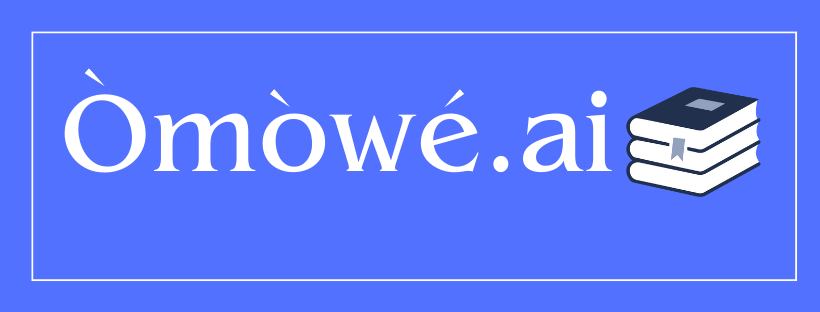

Check out the configuration reference at https://huggingface.co/docs/hub/spaces-config-reference
<p  align="center">



</p>  


# Project Title : Omowe.AI

In today's fast-paced educational environment, students often struggle to navigate through vast amounts of study materials effectively. They spend countless hours searching for relevant information, trying to assimilate lengthy study materials, solving practice questions, and ensuring their essays are well-structured and plagiarism-free. This lack of efficient study tools not only hampers academic performance but also adds unnecessary stress to students' lives.

## Try it out here:  **[omowe.ai](https://huggingface.co/spaces/paulokewunmi/omowe.ai)**

## Omowe.ai addresses these issues using a suit of tools tools:

1. **Semantic Search in 100+ languages**: Our service enables students to perform searches across a pre-indexed library of study materials in their native language. This saves valuable time and ensures they have access to the information they need quickly and efficiently.

2. **Summarization**: Generate concise and coherent summaries, capturing the essence of the original study text. This enables students to grasp key concepts and information more effectively, making their study sessions more efficient.

3. **Practice Question Generation**: Students can reinforce their understanding, test their knowledge, and prepare for exams by practising with relevant and tailored questions.

4. **Paraphrasing Assistance**:  Students can rephrase their sentences while maintaining the intended meaning. This can enhance the quality of essays, avoid plagiarism, and improve writing skills.


## Getting Started

These instructions will help you get a copy of the project up and running on your local machine.

### Installing

1. Clone the repository:

```
    git clone https://github.com/Paulooh007/omowe.ai.git
```

2. Change directory to the project root:

```
    cd omowe.ai
```

3. Install the required libraries:

```
    pip install -r requirements.txt
```

4. Run the app

```
    python app.py
```

## Tools & Technologies used:

1. **[Cohere](https://docs.cohere.ai/docs/the-cohere-platform)**: Cohere offers capability to add cutting-edge language processing to any system. They train large language models with API access. <font face="Trebuchet MS">Legal-ease</font> uses Cohere's `multilingual-22-12` model to obtain multilingual embeddings, the `summarize-xlarge` model for summarization and `command-xlarge-nightly` for question answering.

2.  **[Pinecone](https://www.pinecone.io/ Qdrant is a vector similarity engine & vector database and comes with an API service for semantic search - searching for the nearest high-dimensional vectors. 

3.  **[Langchain](https://langchain.readthedocs.io/en/latest/getting_started/getting_started.html)**: It is an open source library that provides abstractions for building LLM-based applications

4.  **[Gradio](https://gradio.app/docs/)**: The frontend of the application is built using Gradio.

5. **[HF Spaces](https://huggingface.co/docs/hub/spaces-overview)**: Hugging Face Spaces offers deployment support for ML applications. [Here is the link to our space](https://huggingface.co/spaces/paulokewunmi/omowe.ai)

## Datasets Used.

1. **[Huggingface wikipedia dataset](https://huggingface.co/datasets/wikipedia)**: Wikipedia dataset containing cleaned articles of all languages.


## References:

- [Langchain Question-Answering guide](https://langchain.readthedocs.io/en/latest/use_cases/question_answering.html)

- [MultiLingual Semantic Search using Cohere and Langchain](https://txt.cohere.ai/search-cohere-langchain/)

- [Cohere vs. OpenAI embeddings — multilingual search (James Briggs)](https://qdrant.tech/articles/qa-with-cohere-and-qdrant/)


## Acknowledgements:

- We'd like to thank [shivalika singh and Pratik Mehta](https://github.com/shivalikasingh95/legal-ease) for their github, we found thier Gradio template/theme and some of thier functions very helpful